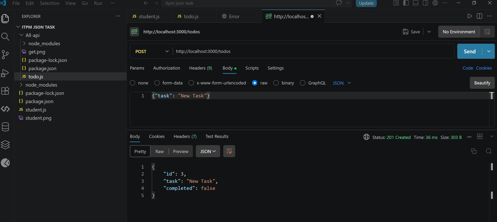
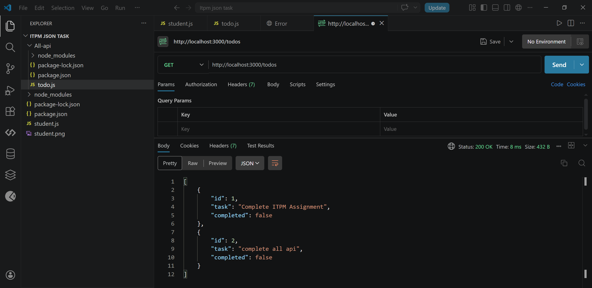
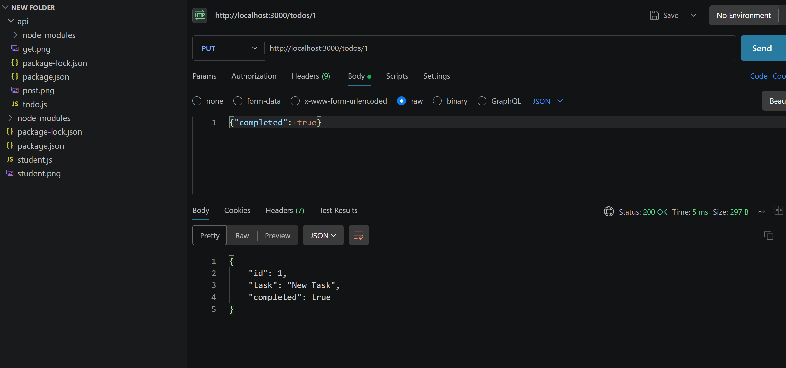
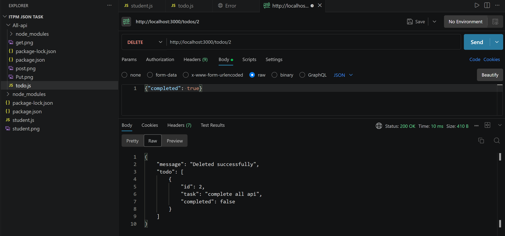

# ITPM-TASK

/student

API Verification (Postman)
Below is the screenshot of the successful API request made to `http://localhost:3000/student`:

## Postman Testing Results
| Action | Screenshot |
| :--- | :--- |
| Create Todo |  |
| Get All |  |
| Update |  |
| Delete |  |
