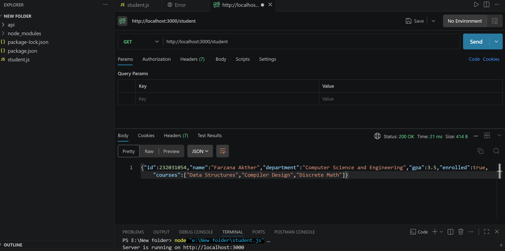

# ITPM-TASK
/student route that returns student info as JSON to the frontend.

API Verification (Postman)
Below is the screenshot of the successful API request made to `http://localhost:3000/student`:

